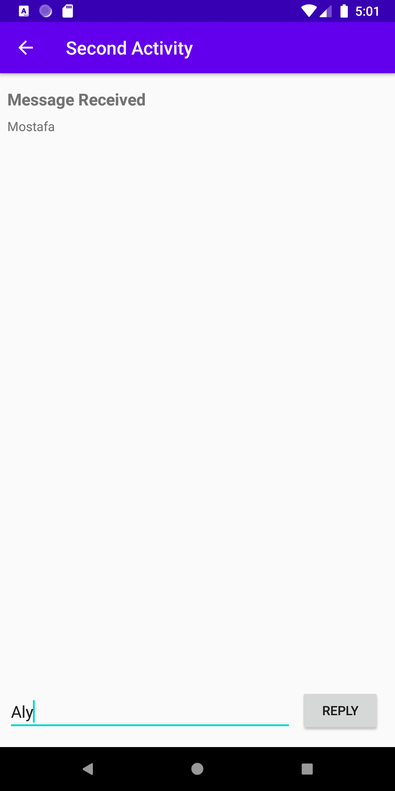

# Activity-and-Intents
Pass some data (a string) from the main Activity to the second using an Intent, and display that data in the second Activity.
Send a second different bit of data back to the main Activity, also using an Intent Back

              
